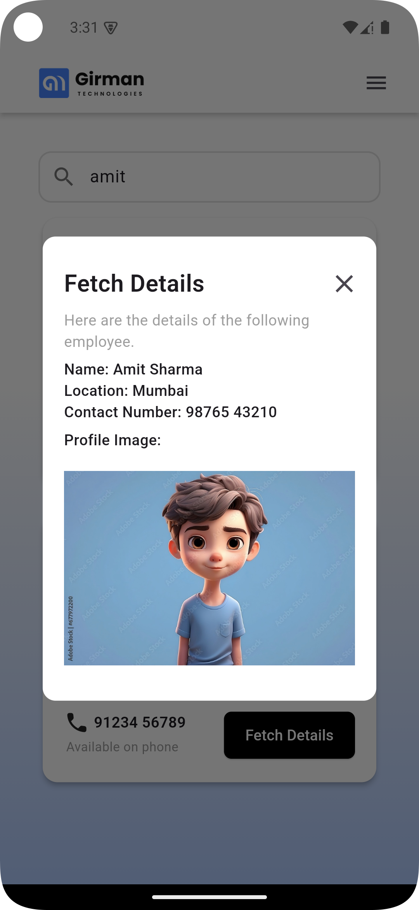

# Flutter Task Application

This Flutter application allows users to search for user details, view them, and open specific links using a popup menu. It integrates Firebase for real-time database functionality and uses the `provider` package for state management.

## Features

- **Search Functionality**: Search users by their first or last name.
- **User Details**: View detailed information about users in a custom dialog.
- **Popup Menu**: Open specific URLs (website, LinkedIn) or send an email via the popup menu.
- **Firebase Integration**: Fetch data in real-time from Firebase Database.

## Screenshots

  
  
  

## Links

- [App APK Link](https://we.tl/t-uOQmkcbtip)